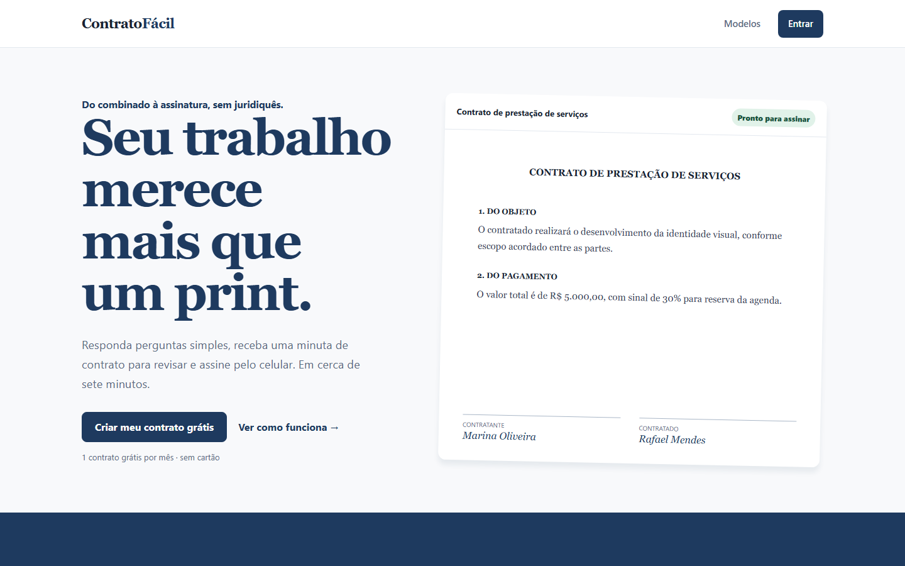
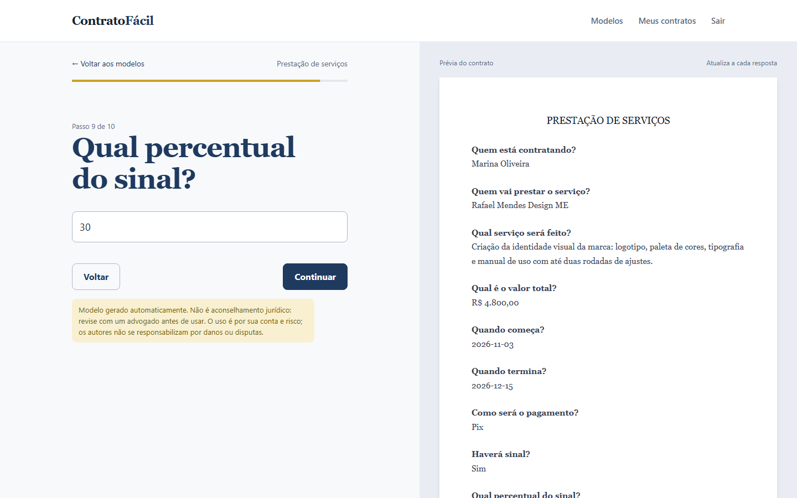
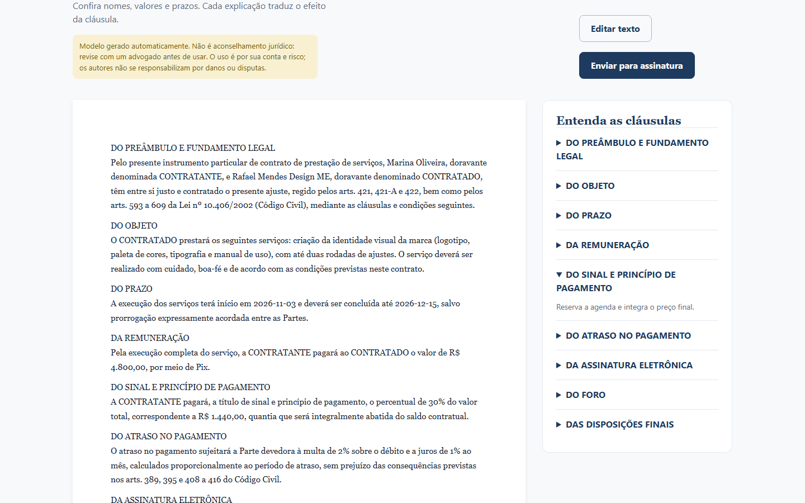
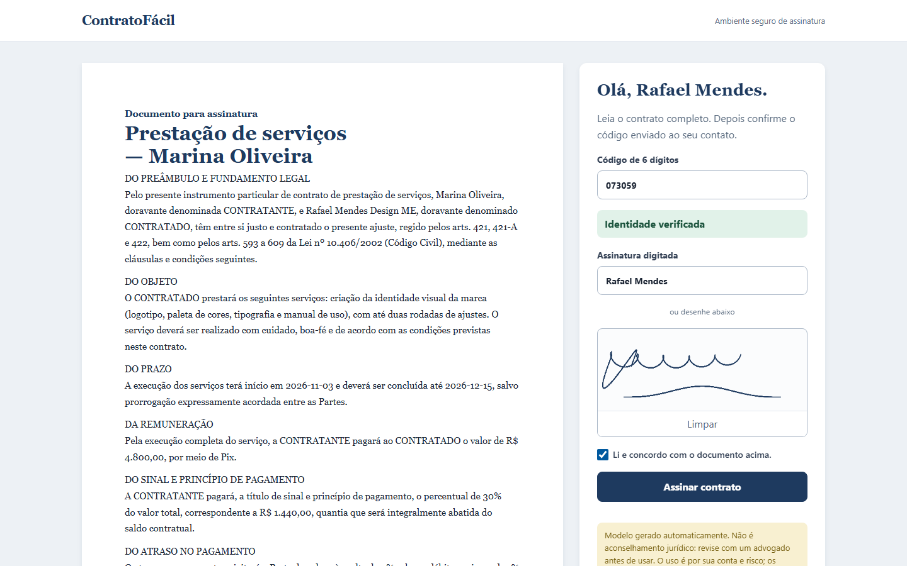

# ContratoFácil

Answer a short questionnaire in plain language, get a contract draft, and collect electronic signatures in order with an audit trail.

The UI and the contract templates are in Brazilian Portuguese.

## Disclaimer / Aviso legal

**English.** This software generates contract drafts automatically. It is not legal advice and does not replace a lawyer. Every contract must be reviewed by a qualified legal professional before it is used or signed. The software is provided "as is", without warranties of any kind. The authors and contributors are not liable for any damages, losses, disputes or legal proceedings arising from the use of this software or from any document generated with it. Use is entirely at your own risk. See also the [LICENSE](LICENSE).

**Português.** Este software gera minutas de contrato automaticamente. Não é aconselhamento jurídico e não substitui um advogado. Todo contrato deve ser revisado por um profissional habilitado antes de ser usado ou assinado. O software é fornecido "no estado em que se encontra", sem garantias de qualquer tipo. Os autores e colaboradores não se responsabilizam por danos, perdas, disputas ou processos judiciais decorrentes do uso deste software ou de documentos gerados com ele. O uso é inteiramente por sua conta e risco.

## What it does

- Six guided templates (service agreement, creative freelance with copyright assignment, equipment rental, debt acknowledgement, business partnership, NDA). Each answer turns clauses on or off.
- Review screen with a plain-language explanation next to every clause, plus an editor for the final text.
- Sends one signing link per party and enforces the signing order.
- Each party confirms a 6-digit code before signing, then types or draws a signature on a canvas.
- Stores every view, verification and signature as an audit event and hashes the signed contract with SHA-256.
- Contract vault with status filters, PDF download, daily reminders for pending signatures and expiring contracts, and Pix installments marked as paid through a webhook.

## Screenshots


Landing page.


Questionnaire: a follow-up question appears only after "Haverá sinal? Sim", and the preview fills in as you answer.


Review screen with the generated draft and a plain-language explanation for each clause.


Signing page for the second party, after the 6-digit code check, with typed and drawn signature.

## Interesting parts

**Conditional clause engine.** Every `Clause` row has a JSON `condition` such as `{"key": "has_down_payment", "equals": true}`. An empty condition always renders; a key without `equals` checks for a truthy answer. The same shape drives `Question.display_condition`, so a follow-up question ("what percentage?") only shows up when its parent answer is set, and the frontend evaluates it with the same rule. Clause texts are `str.format_map` templates; answers are HTML-escaped first, missing keys render as `[key]` instead of crashing, and derived values such as the down payment in BRL are computed server-side. See `backend/contracts/services.py`.

**Ordered signing with verification codes.** When a contract is sent, each party gets a random URL token and a 6-digit code. Only the SHA-256 digest of the code is stored, it expires after 30 minutes and is compared with `secrets.compare_digest`. The sign endpoint returns `409` while any party with a lower `signing_order` has not signed yet, and the verify/sign endpoints are rate limited (20 requests per minute per anonymous client). In local mode the API returns the plain code so you can test the flow without email.

**Immutable `SignatureEvent`.** Audit events (viewed, verified, signed, with IP and user agent) cannot be changed through the model: `save()` on an existing row and `delete()` both raise, and the foreign key to the party uses `PROTECT`.

**SHA-256 over body and signatures.** When the last party signs, the contract hash is computed over the final body plus every party's name and signing timestamp, so changing either the text or the signature record changes the hash.

**Audit page in the PDF.** The PDF endpoint appends an audit section with the SHA-256 hash and the full event list (event, party, time, IP). With WeasyPrint it starts on its own page.

**Windows PDF fallback.** WeasyPrint needs GTK/Pango, which is painful on Windows. On `os.name == "nt"` the backend writes a minimal PDF 1.4 by hand instead (one page, plain text, first 52 lines), so the whole flow still works without Docker. Docker uses WeasyPrint for the full layout.

**HTML allowlist for edited contracts.** Edited contract text is parsed with `html.parser` and only `<section><h2/><p/></section>` without attributes or comments is accepted, which keeps script injection out of the stored body. The PDF does not trust the stored HTML either: the body is reduced to plain-text headings and paragraphs, rendered through an autoescaped Django template, and WeasyPrint gets a URL fetcher that refuses everything except `data:` URIs, so a crafted title or party name cannot make the server fetch remote URLs or read local files.

## Stack

- Backend: Python 3.13 (Docker image), Django 5.2, Django REST Framework, SimpleJWT, Celery with Redis (worker and beat), WeasyPrint
- Database: PostgreSQL 16 (SQLite when `DATABASE_URL` is not set)
- Frontend: React 18, TypeScript, Vite 6, Tailwind CSS 4 with hand-written CSS tokens, Zustand, React Router
- Tests: pytest with pytest-django, Vitest with Testing Library
- Infra: Docker Compose (db, redis, backend, worker, beat, frontend served by Nginx)

## Run it locally

### With Docker

```bash
cp .env.example .env    # then set POSTGRES_PASSWORD and PIX_WEBHOOK_SECRET
docker compose up --build
```

The backend container runs migrations and `python manage.py seed_demo` (loads the six templates) on start.

- App: http://localhost:5173
- API health check: http://localhost:8000/api/health/

There is no demo account. Create one at http://localhost:5173/cadastro. Emails are printed to the backend/worker logs (console email backend).

### Without Docker

Backend (uses SQLite and runs Celery tasks inline):

```bash
cd backend
python -m venv .venv
source .venv/bin/activate     # Linux/macOS
# .venv\Scripts\activate      # Windows (PowerShell or cmd)
pip install -r requirements.txt
python manage.py migrate
python manage.py seed_demo
python manage.py runserver
```

Frontend, in another terminal:

```bash
cd frontend
npm ci
npm run dev
```

On Linux/macOS outside Docker, PDF generation needs the Pango libraries that WeasyPrint depends on.

In local mode the "send for signature" screen shows each signing link and its verification code, so you can sign as every party from the same browser.

## Tests

Backend (from `backend/`, with the virtualenv active):

```bash
python -m pytest
```

Frontend (from `frontend/`):

```bash
npm ci
npm test
npm run build    # type check + production build
```

Inside the Docker stack: `docker compose exec backend pytest`.

## Project status

Portfolio demo, not a production service.

- Pix is simulated: installments get a local transaction id and are marked as paid by `POST /webhooks/pix/` with a shared secret. No payment provider is integrated.
- WhatsApp is simulated: contacts without an `@` are accepted, but no message is sent. Email uses the console backend by default.
- The pricing section on the landing page is display only; there is no billing.
- The contract texts are technical demonstrations, not legal advice, and have not been reviewed by a lawyer (see the disclaimer above). The app shows the same notice on the questionnaire, review and signing screens, and the generated PDF carries it in the page footer.
- Dev defaults are not hardened: `DEBUG` is on, `ALLOWED_HOSTS` is `*`, the backend runs on `runserver`, and there are no password validators beyond an 8-character minimum.

Built with AI coding assistants as part of my workflow.

## License

MIT, see [LICENSE](LICENSE).

## Versão em português

ContratoFácil gera contratos de prestação de serviço a partir de um questionário em linguagem simples e coleta assinaturas eletrônicas na ordem definida, com código de verificação, trilha de auditoria e hash SHA-256.
Para rodar: `docker compose up --build` e acesse http://localhost:5173.
É um projeto de portfólio: Pix e WhatsApp são simulados e os textos dos contratos não substituem orientação jurídica.
